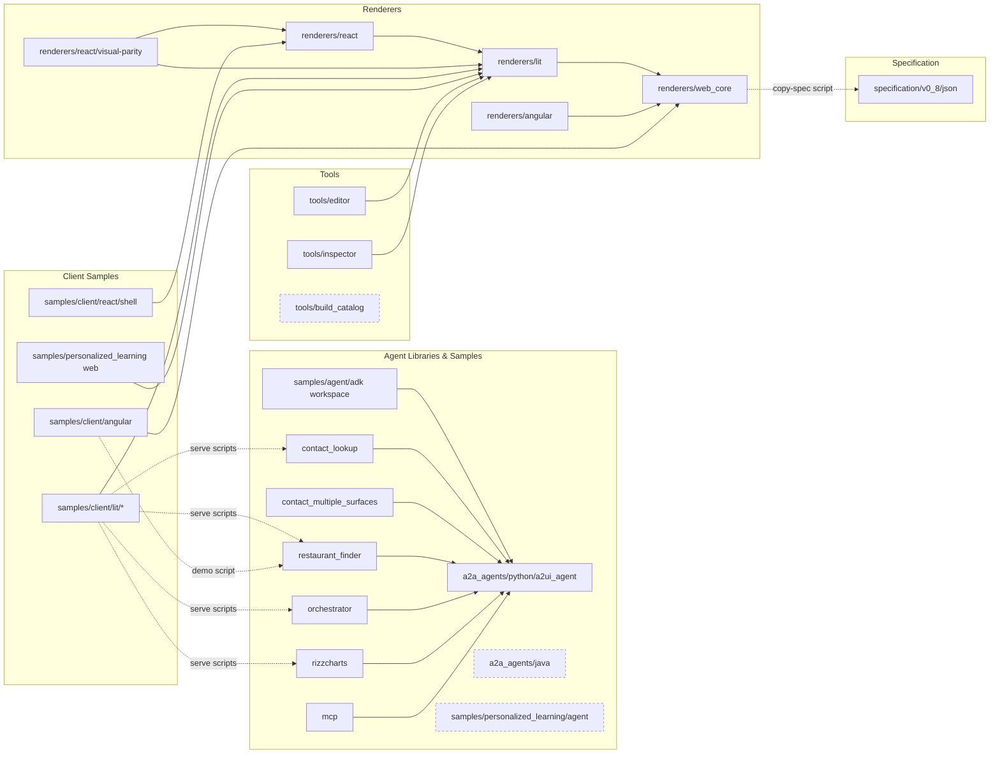

# A2UI-add-react-renderer Dependency Map

## 1) Summary
This document consolidates dependency relationships across subprojects in `A2UI-add-react-renderer`.

- Scope: internal project-to-project dependencies + key external direct dependencies.
- Source of truth: `pyproject.toml`, `package.json`, and `pom.xml` only.
- Relationship types used here:
  - `path/editable`: Python `uv` local source mapping
  - `file:`: Node local package link
  - `workspace`: Node workspace inclusion
  - `script-link`: runtime/dev script that directly starts/builds another project

## 2) Internal Dependency Matrix

| Project | Manifest Source | Depends On (Internal) | Relation Type |
|---|---|---|---|
| `samples/agent/adk` (workspace root) | `samples/agent/adk/pyproject.toml` | `a2a_agents/python/a2ui_agent` | `path/editable` via `[tool.uv.sources]` |
| `samples/agent/adk/contact_lookup` | `samples/agent/adk/contact_lookup/pyproject.toml` | `a2ui-agent` (resolved from adk workspace source) | `path/editable` (workspace-resolved) |
| `samples/agent/adk/contact_multiple_surfaces` | `samples/agent/adk/contact_multiple_surfaces/pyproject.toml` | `a2ui-agent` (resolved from adk workspace source) | `path/editable` (workspace-resolved) |
| `samples/agent/adk/restaurant_finder` | `samples/agent/adk/restaurant_finder/pyproject.toml` | `a2ui-agent` (resolved from adk workspace source) | `path/editable` (workspace-resolved) |
| `samples/agent/adk/orchestrator` | `samples/agent/adk/orchestrator/pyproject.toml` | `a2ui-agent` (resolved from adk workspace source) | `path/editable` (workspace-resolved) |
| `samples/agent/adk/rizzcharts` | `samples/agent/adk/rizzcharts/pyproject.toml` | `a2a_agents/python/a2ui_agent` | `path/editable` via local `[tool.uv.sources]` |
| `samples/agent/adk/mcp` | `samples/agent/adk/mcp/pyproject.toml` | `a2a_agents/python/a2ui_agent` | `path/editable` via local `[tool.uv.sources]` |
| `renderers/lit` | `renderers/lit/package.json` | `renderers/web_core` | `file:` (`@a2ui/web_core`) |
| `renderers/angular` | `renderers/angular/package.json` | `renderers/web_core` | `file:` (`@a2ui/web_core`) |
| `renderers/react` | `renderers/react/package.json` | `renderers/lit` | `file:` (`@a2ui/lit`) |
| `renderers/react/visual-parity` | `renderers/react/visual-parity/package.json` | `renderers/react`, `renderers/lit` | `file:` |
| `samples/client/react/shell` | `samples/client/react/shell/package.json` | `renderers/react` | `file:` (`@a2ui/react`) |
| `samples/client/lit/*` (workspace) | `samples/client/lit/package.json` + workspace package manifests | `renderers/lit`; ADK agents (`restaurant_finder`, `contact_lookup`, `rizzcharts`, `orchestrator`) | `file:` + `script-link` |
| `samples/client/angular` | `samples/client/angular/package.json` | `renderers/web_core`, `samples/agent/adk/restaurant_finder` | `file:` + `script-link` |
| `samples/client/angular/projects/a2a-chat-canvas` | `samples/client/angular/projects/a2a-chat-canvas/package.json` | `samples/client/angular/projects/lib`, `renderers/web_core` | `file:` |
| `samples/client/angular/projects/lib` | `samples/client/angular/projects/lib/package.json` | `renderers/web_core` | `file:` |
| `samples/personalized_learning` (web app) | `samples/personalized_learning/package.json` | `renderers/lit` | `file:` (`@a2ui/web-lib`) |
| `tools/editor` | `tools/editor/package.json` | `renderers/lit` | `file:` |
| `tools/inspector` | `tools/inspector/package.json` | `renderers/lit` | `file:` |
| `renderers/web_core` | `renderers/web_core/package.json` | `specification/v0_8/json` | `script-link` (`copy-spec` build step) |

## 3) Mermaid Graph (Internal)

## 4) Key External Dependencies (Direct, High-impact)

| Area | Project(s) | Key External Dependencies |
|---|---|---|
| Python agent SDK core | `a2a_agents/python/a2ui_agent` | `a2a-sdk`, `google-adk`, `google-genai`, `jsonschema` |
| ADK sample agents | `contact_*`, `restaurant_finder`, `orchestrator`, `rizzcharts` | `a2a-sdk`, `google-adk`, `google-genai`, `litellm`, `python-dotenv`, `click`, `jsonschema` |
| ADK MCP sample | `samples/agent/adk/mcp` | `mcp`, `httpx`, `anyio`, `click` |
| Java extension | `a2a_agents/java` | `a2a-java-sdk-client`, `a2a-java-sdk-server-common`, `junit-jupiter` |
| Web core renderer | `renderers/web_core` | `typescript`, `wireit` |
| Lit renderer | `renderers/lit` | `lit`, `@lit/context`, `@lit-labs/signals`, `markdown-it` |
| Angular renderer/client | `renderers/angular`, `samples/client/angular` | `@angular/*`, `@a2a-js/sdk`, `markdown-it`, `vite`, `concurrently` |
| React renderer/client | `renderers/react`, `samples/client/react/shell` | `react`, `react-dom`, `vite`, `clsx`, `markdown-it`, `tsup` |
| Personalized learning sample | `samples/personalized_learning` (+ agent) | `firebase`, `firebase-admin`, `google-auth-library`, `@google/genai`, `lit`; agent side `google-adk`, `google-genai`, `google-cloud-storage` |
| Dev tools | `tools/editor`, `tools/inspector`, `tools/build_catalog` | `lit`, `vite`, `wireit`, `typescript` |

## 5) Evidence Files

- `a2a_agents/python/a2ui_agent/pyproject.toml`
- `a2a_agents/java/pom.xml`
- `samples/agent/adk/pyproject.toml`
- `samples/agent/adk/*/pyproject.toml`
- `renderers/web_core/package.json`
- `renderers/lit/package.json`
- `renderers/angular/package.json`
- `renderers/react/package.json`
- `renderers/react/visual-parity/package.json`
- `samples/client/lit/package.json`
- `samples/client/angular/package.json`
- `samples/client/angular/projects/*/package.json`
- `samples/client/react/shell/package.json`
- `samples/personalized_learning/package.json`
- `samples/personalized_learning/agent/pyproject.toml`
- `tools/editor/package.json`
- `tools/inspector/package.json`
- `tools/build_catalog/pyproject.toml`
